# OOP — Abstraction

## The Core Idea

> Abstraction = Hiding Complexity + Showing Essentials

Separate **what** an object does from **how** it does it.

---

## 1. Real-World Analogy — Driving a Car

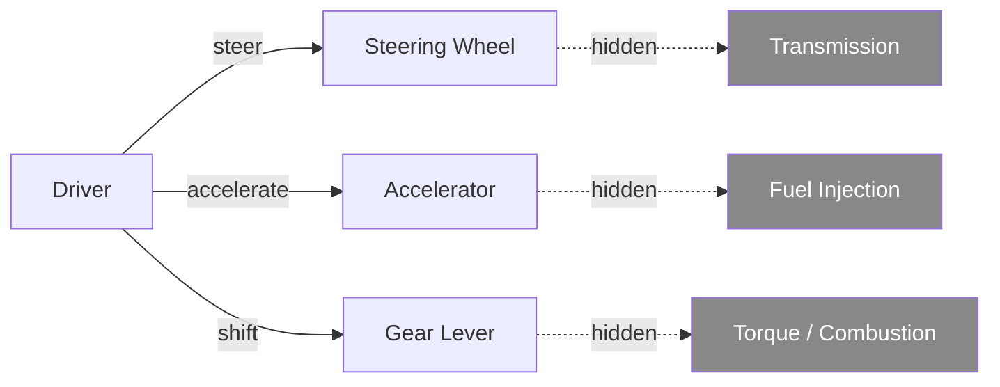

You interact with simple controls. The mechanical complexity is hidden. That's abstraction.

---

## 2. Why Abstraction Matters

### Without Abstraction — Tightly Coupled

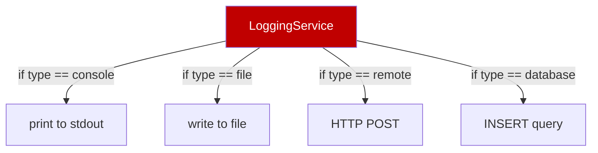

Every new destination = another branch in `LoggingService`. Testing one logger requires the whole class. Changing one format risks breaking others.

### With Abstraction — Decoupled

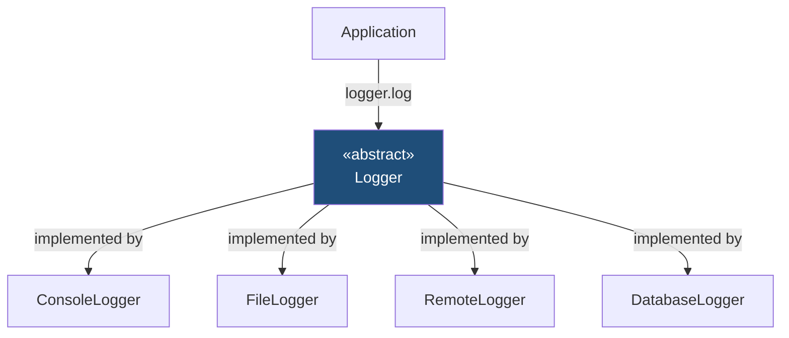

`Application` only knows about `Logger`. Swap implementations by changing one line.

---

## 3. How Abstraction Is Achieved

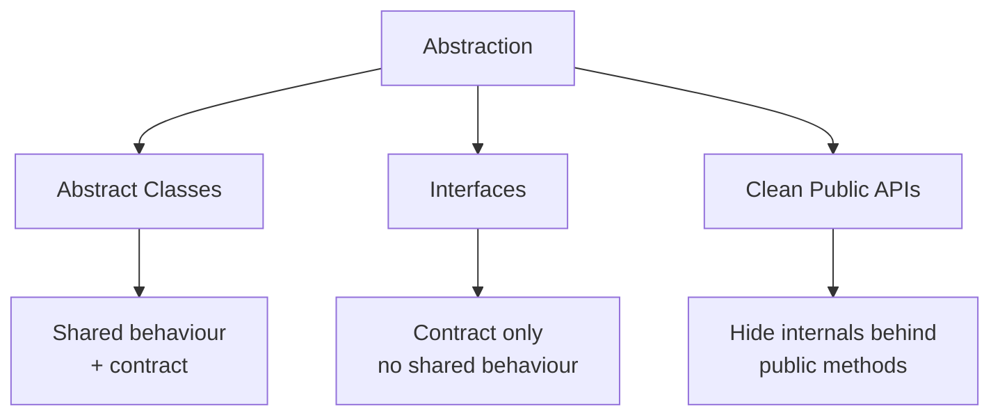

---

## 4. Abstract Classes

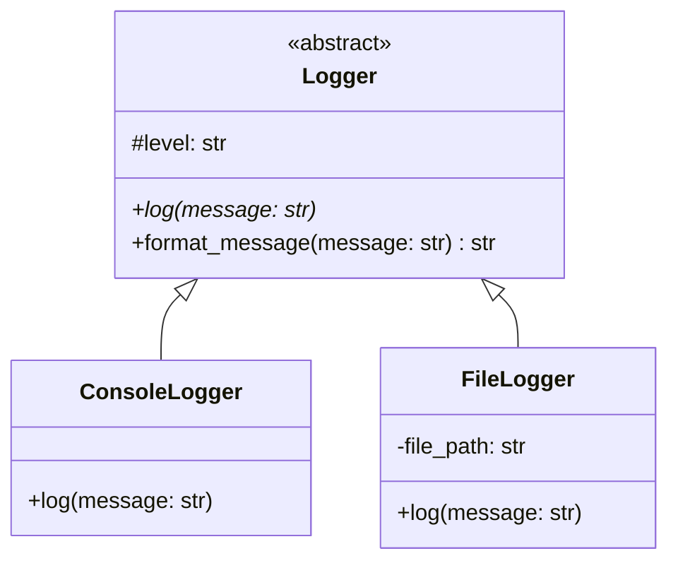

```python
from abc import ABC, abstractmethod
from datetime import datetime

class Logger(ABC):
    def __init__(self, level: str):
        self.level = level

    # concrete — shared by all subclasses
    def format_message(self, message: str) -> str:
        timestamp = datetime.now().strftime("%Y-%m-%d %H:%M:%S")
        return f"[{timestamp}] [{self.level}] {message}"

    # abstract — each subclass must implement
    @abstractmethod
    def log(self, message: str) -> None:
        pass


class ConsoleLogger(Logger):
    def log(self, message: str) -> None:
        print(self.format_message(message))    # inherits format_message for free


class FileLogger(Logger):
    def __init__(self, level: str, file_path: str):
        super().__init__(level)
        self.file_path = file_path

    def log(self, message: str) -> None:
        with open(self.file_path, "a") as f:
            f.write(self.format_message(message) + "\n")
```

> **Key value over interfaces** — `format_message()` is written once and inherited. Without abstraction you'd duplicate that logic in every logger.

---

## 5. Interfaces as Abstraction

When **unrelated classes** share a capability (not a family relationship), use an interface.

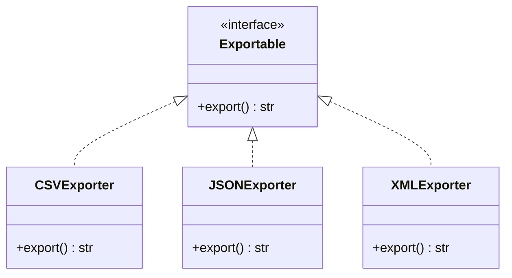

```python
from abc import ABC, abstractmethod

class Exportable(ABC):
    @abstractmethod
    def export(self) -> str:
        pass

class CSVExporter(Exportable):
    def export(self) -> str:
        return "id,name,value\n1,scan,0.91"

class JSONExporter(Exportable):
    def export(self) -> str:
        return '{"id": 1, "name": "scan", "value": 0.91}'
```

No shared behaviour — purely a contract. Any code that needs to export depends on `Exportable`, not on a specific exporter.

---

## 6. Public APIs as Abstraction

No inheritance needed. A well-designed class that hides internal complexity behind clean public methods **is** abstraction.

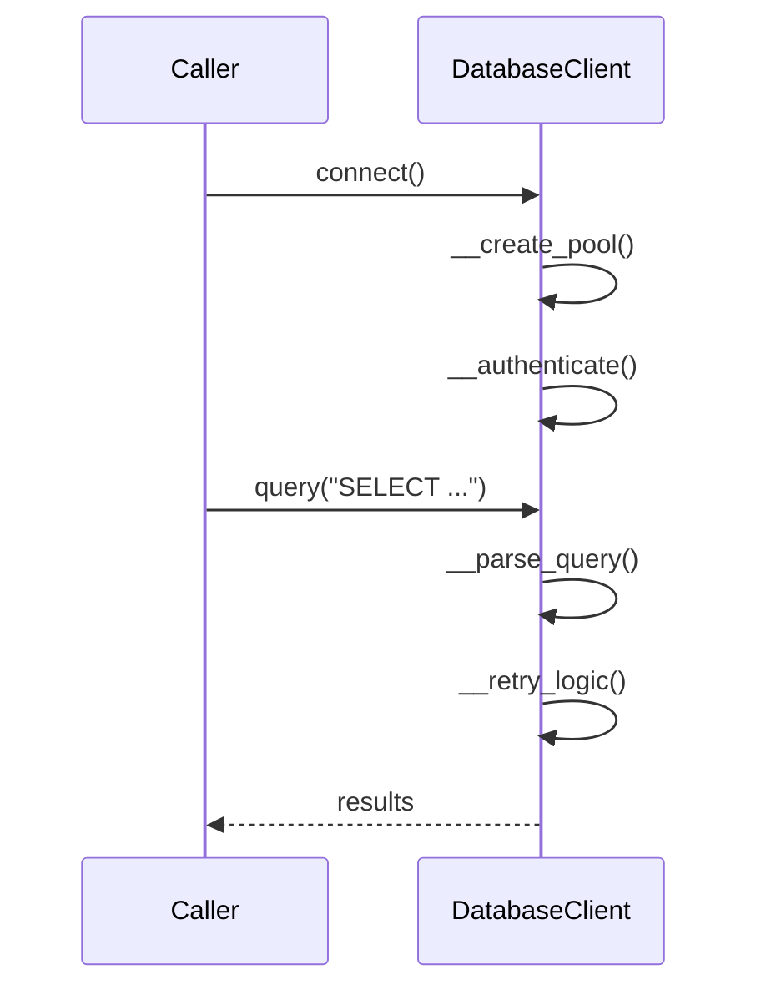

```python
class DatabaseClient:
    def connect(self, host: str, port: int) -> None:
        self.__create_pool(host, port)   # hidden
        self.__authenticate()            # hidden

    def query(self, sql: str) -> list:
        parsed = self.__parse_query(sql) # hidden
        return self.__execute(parsed)    # hidden

    # private — caller never sees these
    def __create_pool(self, host, port): ...
    def __authenticate(self): ...
    def __parse_query(self, sql): ...
    def __execute(self, parsed): ...


# Caller sees only this
client = DatabaseClient()
client.connect("db.hospital.com", 5432)
results = client.query("SELECT * FROM patients")
```

---

## 7. Abstraction vs Encapsulation

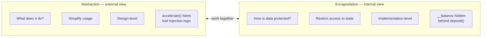

| Aspect | Encapsulation | Abstraction |
|---|---|---|
| Focus | Protecting data | Hiding complexity |
| Goal | Restrict access to state | Simplify usage |
| Level | Implementation | Design |
| Example | `__balance` in `BankAccount` | Exposing only `deposit()` / `withdraw()` |

> **Encapsulation protects. Abstraction simplifies.**

---

## 8. Practical Example — Media Player

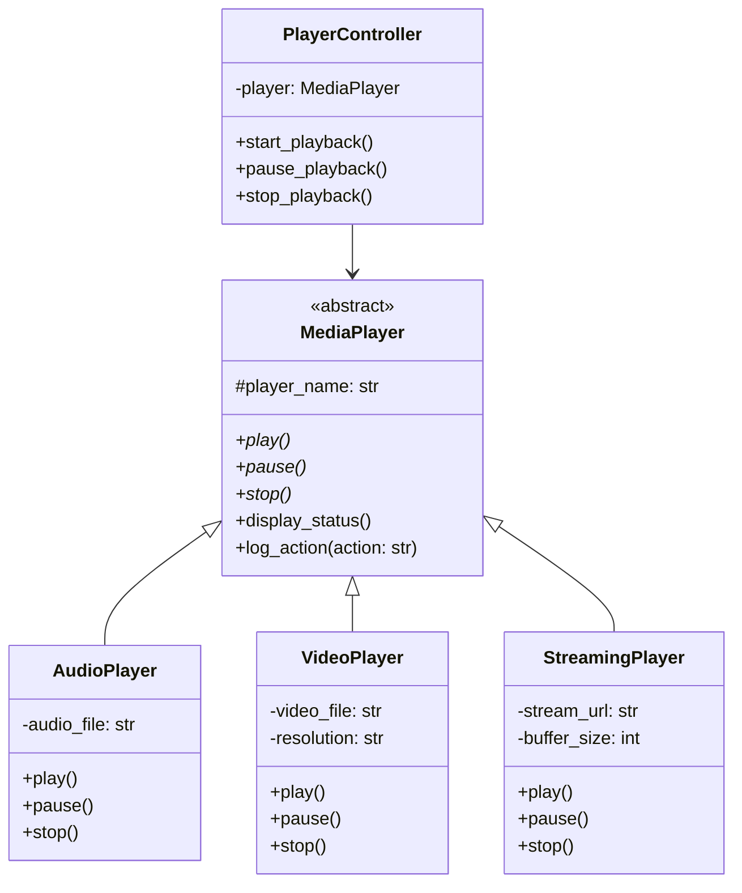

### Lifecycle Flow

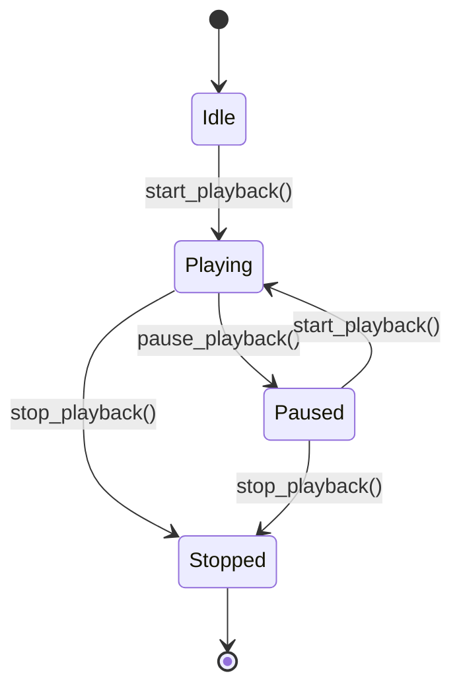

```python
from abc import ABC, abstractmethod

class MediaPlayer(ABC):
    def __init__(self, player_name: str):
        self.player_name = player_name

    @abstractmethod
    def play(self) -> None: pass

    @abstractmethod
    def pause(self) -> None: pass

    @abstractmethod
    def stop(self) -> None: pass

    # concrete — inherited by all players
    def display_status(self) -> None:
        print(f"[{self.player_name}] ready.")

    def log_action(self, action: str) -> None:
        print(f"[LOG] {self.player_name}: {action}")


class AudioPlayer(MediaPlayer):
    def __init__(self, audio_file: str):
        super().__init__("AudioPlayer")
        self.audio_file = audio_file

    def play(self)  -> None: self.log_action(f"Playing audio: {self.audio_file}")
    def pause(self) -> None: self.log_action("Audio paused")
    def stop(self)  -> None: self.log_action("Audio stopped")


class StreamingPlayer(MediaPlayer):
    def __init__(self, stream_url: str, buffer_size: int):
        super().__init__("StreamingPlayer")
        self.stream_url = stream_url
        self.buffer_size = buffer_size

    def play(self)  -> None: self.log_action(f"Buffering {self.buffer_size}KB → streaming {self.stream_url}")
    def pause(self) -> None: self.log_action("Stream paused")
    def stop(self)  -> None: self.log_action("Stream stopped, buffer cleared")


class PlayerController:
    def __init__(self, player: MediaPlayer):
        self.player = player           # depends on abstraction, not concrete class

    def start_playback(self)  -> None: self.player.play()
    def pause_playback(self)  -> None: self.player.pause()
    def stop_playback(self)   -> None: self.player.stop()


# Swap player — controller unchanged
controller = PlayerController(AudioPlayer("scan_report.mp3"))
controller.start_playback()

controller = PlayerController(StreamingPlayer("https://stream.hospital.com/live", 512))
controller.start_playback()
```

---

## Quick Reference

| Mechanism | Has shared behaviour | Has contract | Use when |
|---|---|---|---|
| Abstract class | ✅ | ✅ | Related classes sharing common logic |
| Interface | ❌ | ✅ | Unrelated classes sharing a capability |
| Public API | ✅ | ❌ | Single class hiding internal complexity |

---

## Summary — All Five OOP Concepts

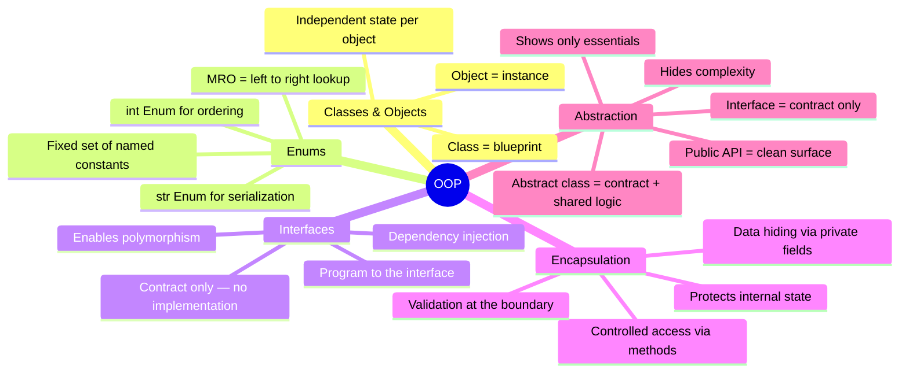

> **Classes** give structure. **Enums** give safe constants. **Interfaces** give contracts. **Encapsulation** protects state. **Abstraction** simplifies complexity.