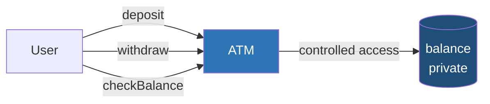
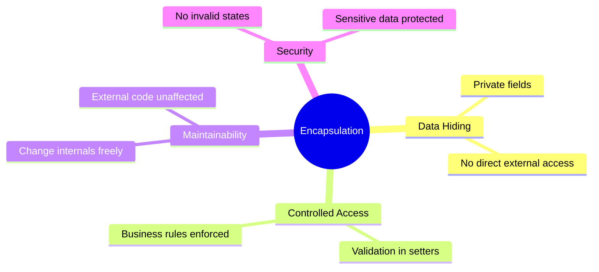
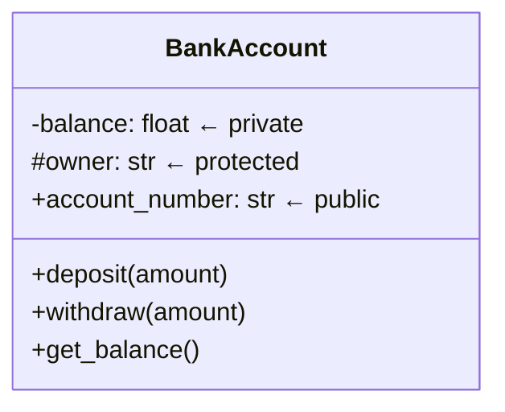
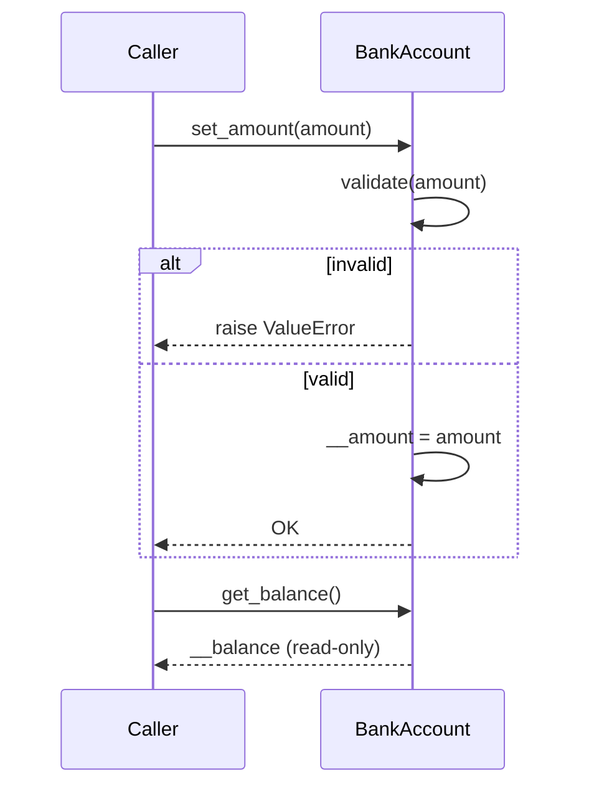
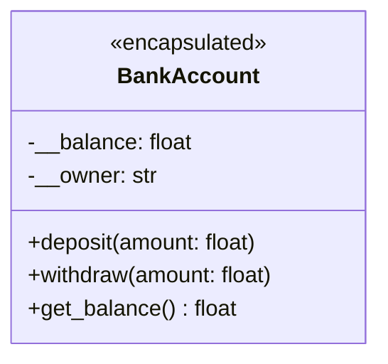
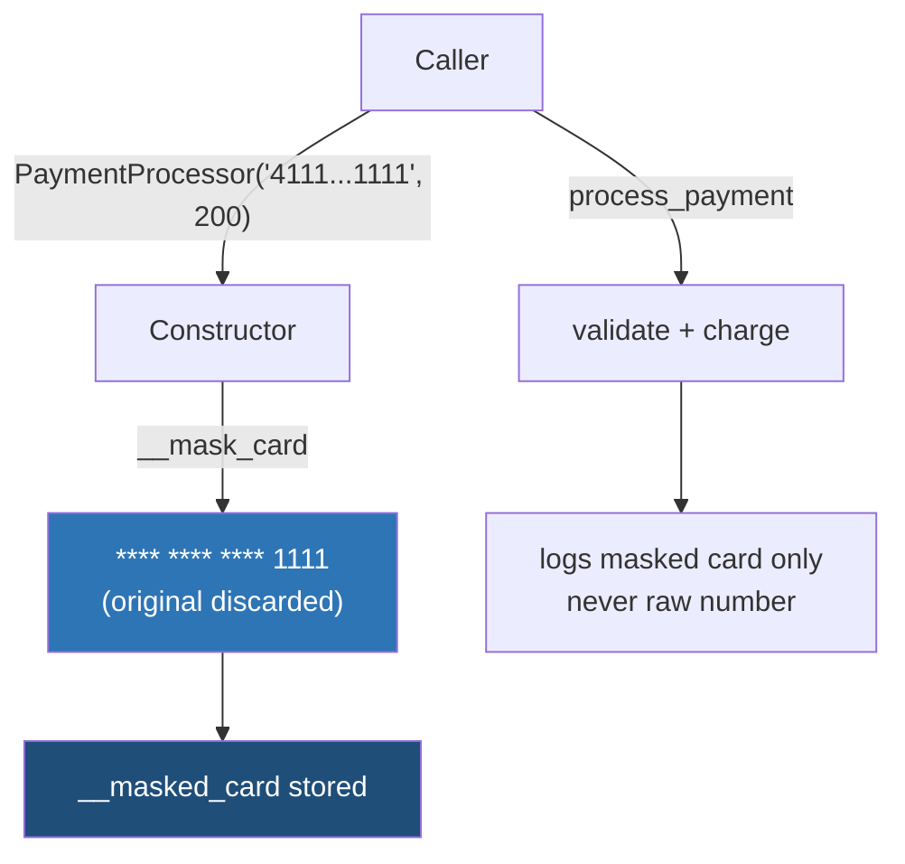
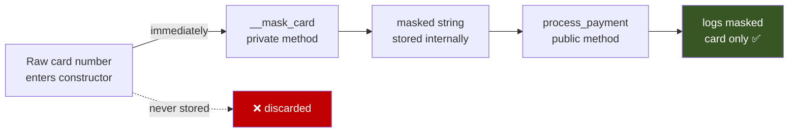
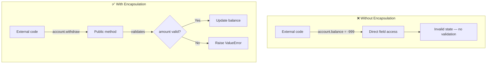
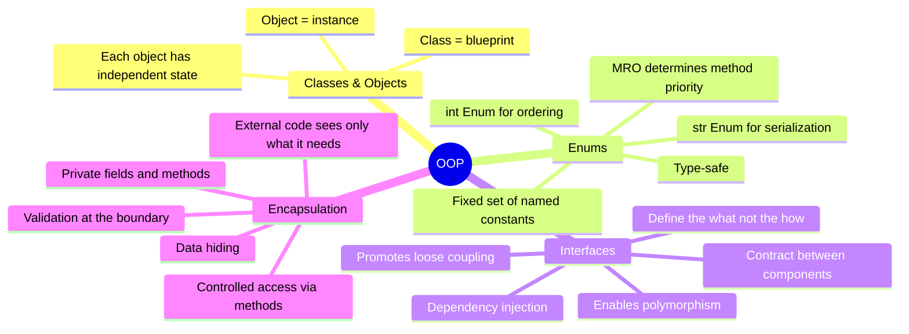

# OOP — Encapsulation

## The Core Idea

> Encapsulation = Data hiding + Controlled access

Group data and behaviour into a single unit and **restrict direct access** to internal details. External code only sees what it needs to.

---

## 1. Real-World Analogy — ATM



You don't walk into the vault and change numbers yourself. You interact through a well-defined interface — the ATM. The bank can change how it stores or validates data internally — none of that affects how you use the ATM.

---

## 2. Why Encapsulation Matters



---

## 3. Access Modifiers



| Modifier | Symbol | Accessible From |
|---|---|---|
| `private` | `__` (dunder) | Same class only |
| `protected` | `_` (single underscore) | Class + subclasses |
| `public` | no prefix | Anywhere |

> **Rule of thumb** — make everything private by default, then selectively expose what needs to be public.

```python
class BankAccount:
    def __init__(self, owner: str):
        self.__balance = 0.0      # private   — no external access
        self._owner = owner       # protected — subclasses can access
        self.account_id = "ACC-1" # public    — anyone can read

account = BankAccount("Alice")
print(account.__balance)   # ❌ AttributeError
print(account._owner)      # ✅ works (but convention says: don't)
print(account.account_id)  # ✅ works
```

---

## 4. Getters and Setters



```python
class BankAccount:
    def __init__(self):
        self.__balance = 0.0

    # Getter — read-only access
    def get_balance(self) -> float:
        return self.__balance

    # Setter — with validation
    def deposit(self, amount: float) -> None:
        if amount <= 0:
            raise ValueError("Deposit amount must be positive.")
        self.__balance += amount
```

---

## 5. Complete Example — BankAccount



```python
class BankAccount:
    def __init__(self, owner: str, initial_balance: float = 0.0):
        self.__owner = owner
        self.__balance = initial_balance

    def deposit(self, amount: float) -> None:
        if amount <= 0:
            raise ValueError("Deposit must be positive.")
        self.__balance += amount
        print(f"Deposited ${amount:.2f}. New balance: ${self.__balance:.2f}")

    def withdraw(self, amount: float) -> None:
        if amount <= 0:
            raise ValueError("Withdrawal must be positive.")
        if amount > self.__balance:
            raise ValueError("Insufficient funds.")
        self.__balance -= amount
        print(f"Withdrew ${amount:.2f}. Remaining: ${self.__balance:.2f}")

    def get_balance(self) -> float:
        return self.__balance


account = BankAccount("Alice", 100.0)
account.deposit(50.0)      # ✅ Deposited $50.00
account.withdraw(200.0)    # ❌ ValueError: Insufficient funds
account.__balance = 9999   # ❌ AttributeError — cannot reach private field
```

---

## 6. Practical Example — PaymentProcessor



```python
class PaymentProcessor:
    def __init__(self, card_number: str, amount: float):
        self.__masked_card = self.__mask_card(card_number)  # raw number never stored
        self.__amount = amount

    def __mask_card(self, card_number: str) -> str:
        # private method — caller never needs to know this exists
        return "**** **** **** " + card_number[-4:]

    def process_payment(self) -> None:
        print(f"Processing ${self.__amount:.2f} for card {self.__masked_card}")


processor = PaymentProcessor("4111111111111111", 150.00)
processor.process_payment()
# Processing $150.00 for card **** **** **** 1111

print(processor.__masked_card)   # ❌ AttributeError
processor.__mask_card("...")     # ❌ AttributeError
```

### Why This Works



---

## 7. Encapsulation vs No Encapsulation



---

## Quick Reference

| Concept | What it does | Example |
|---|---|---|
| Private field | Hides data from outside | `self.__balance` |
| Protected field | Accessible to subclasses | `self._owner` |
| Getter | Read-only access to private field | `get_balance()` |
| Setter / method | Write access with validation | `deposit()`, `withdraw()` |
| Private method | Internal logic, not part of public API | `__mask_card()` |

---

## Summary — All Four Concepts So Far



> **Classes** give you structure. **Enums** give you safe constants. **Interfaces** give you contracts. **Encapsulation** protects your internal state.