# OOP — Enums

## The Problem

You need to track the status of a patient's appointment. You could use:

- **Strings** — `"SCHEDULED"`, `"COMPLETED"` → typo `"Completd"` compiles fine, fails silently at runtime
- **Integers** — `1`, `2`, `3` → `if status == 2` means nothing to the next developer

This is exactly what enums solve.

---

## 1. What is an Enum?

An **enum** (enumeration) is a special data type that defines a **fixed set of named constants**.

- Type-safe — only valid values are allowed
- A variable can only take one of the predefined options

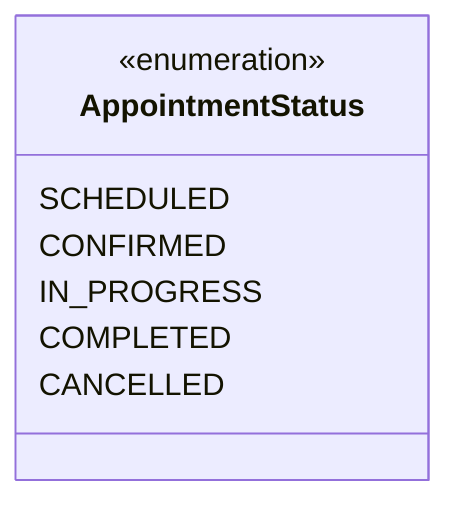

```python
from enum import Enum

class AppointmentStatus(Enum):
    SCHEDULED = "SCHEDULED"
    CONFIRMED = "CONFIRMED"
    IN_PROGRESS = "IN_PROGRESS"
    COMPLETED = "COMPLETED"
    CANCELLED = "CANCELLED"
```

### Why Use Enums?

| Problem | Without Enum | With Enum |
|---|---|---|
| Typos | `"Completd"` silently passes | Caught immediately |
| Magic values | `if status == 3` | `if status == AppointmentStatus.COMPLETED` |
| IDE support | No autocomplete | Full autocomplete + refactoring |
| Valid values | Anyone can pass anything | Only defined values allowed |

### Good Use Cases
- Order/appointment states — `SCHEDULED`, `COMPLETED`, `CANCELLED`
- User roles — `ADMIN`, `DOCTOR`, `TECHNICIAN`
- Scan types — `XRAY`, `CT`, `MRI`
- Directions — `NORTH`, `SOUTH`, `EAST`, `WEST`

---

## 2. Simple Enum

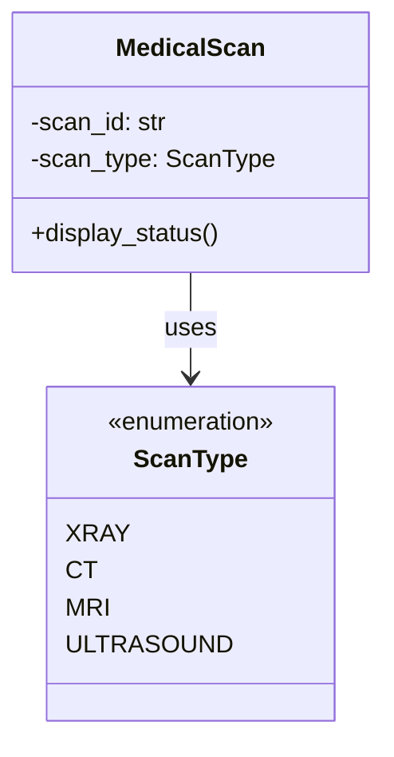

```python
from enum import Enum

class ScanType(Enum):
    XRAY = "XRAY"
    CT = "CT"
    MRI = "MRI"
    ULTRASOUND = "ULTRASOUND"

scan = ScanType.CT
print(scan)        # ScanType.CT
print(scan.value)  # CT
print(scan.name)   # CT
```

---

## 3. Enum with Properties and Methods

Enums can carry additional data and define behaviour. Instead of a separate lookup table, embed the data directly in the enum.

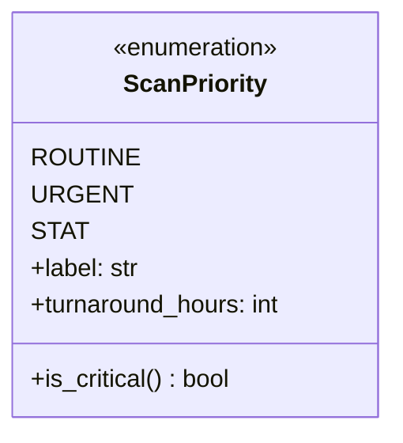

```python
from enum import Enum

class ScanPriority(Enum):
    ROUTINE = ("Routine", 72)
    URGENT  = ("Urgent", 24)
    STAT    = ("STAT", 2)

    def __init__(self, label: str, turnaround_hours: int):
        self.label = label
        self.turnaround_hours = turnaround_hours

    def is_critical(self) -> bool:
        return self.turnaround_hours <= 2

priority = ScanPriority.STAT
print(priority.label)             # STAT
print(priority.turnaround_hours)  # 2
print(priority.is_critical())     # True
```

> The data lives right next to the constant — no risk of value and name going out of sync.

---

## 4. `class(str, Enum)` — String Enum

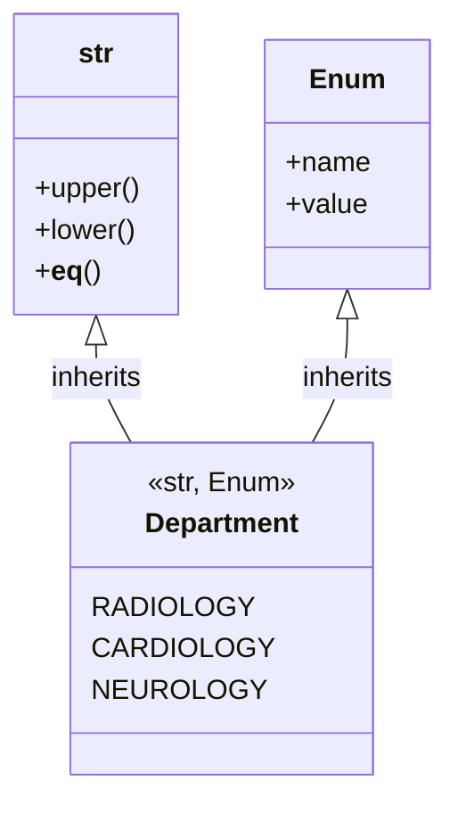

Inheriting from both `str` and `Enum` makes each member **behave like a plain string**.

```python
from enum import Enum

class Department(str, Enum):
    RADIOLOGY  = "radiology"
    CARDIOLOGY = "cardiology"
    NEUROLOGY  = "neurology"

dept = Department.RADIOLOGY
print(dept == "radiology")    # True  ✅
print(dept.upper())           # RADIOLOGY ✅
print(f"Dept: {dept}")        # Dept: radiology ✅
print(isinstance(dept, str))  # True
print(isinstance(dept, Enum)) # True
```

### Key use case — JSON serialization, Django model fields

```python
import json

# Without str Enum
class Status(Enum):
    ACTIVE = "active"

json.dumps({"status": Status.ACTIVE})        # ❌ TypeError
json.dumps({"status": Status.ACTIVE.value})  # ✅ verbose

# With str Enum
class Status(str, Enum):
    ACTIVE = "active"

json.dumps({"status": Status.ACTIVE})        # ✅ {"status": "active"}
```

---

## 5. `class(int, Enum)` — Integer Enum

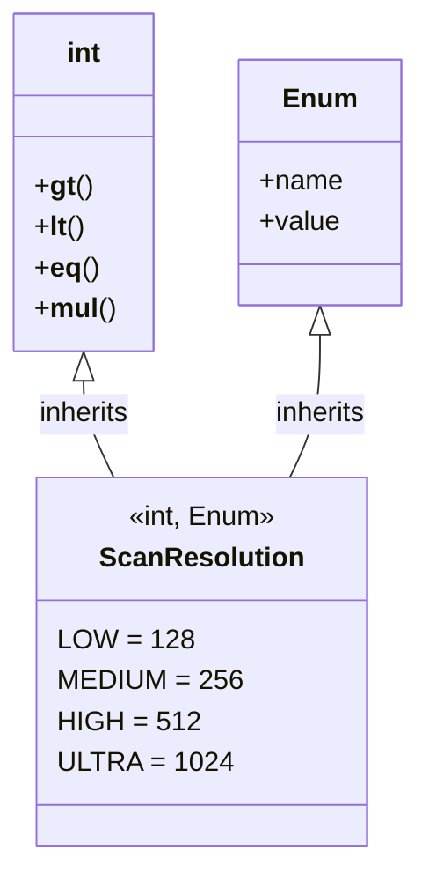

Inheriting from `int` and `Enum` makes each member **behave like a plain integer**.

```python
from enum import Enum

class ScanResolution(int, Enum):
    LOW    = 128
    MEDIUM = 256
    HIGH   = 512
    ULTRA  = 1024

res = ScanResolution.HIGH
print(res == 512)                # True ✅
print(res > ScanResolution.LOW)  # True ✅
print(res * 2)                   # 1024 ✅

def requires_gpu(resolution: ScanResolution) -> bool:
    return resolution >= ScanResolution.HIGH

print(requires_gpu(ScanResolution.ULTRA))  # True
print(requires_gpu(ScanResolution.LOW))    # False
```

---

## 6. MRO — Method Resolution Order

When you write `class Department(str, Enum)`, Python needs to decide **which class's methods take priority**. This is the **MRO**.

### What is MRO?

MRO is the order Python searches for methods across a class hierarchy, computed using the **C3 Linearization algorithm**.

### MRO for `str` Enum

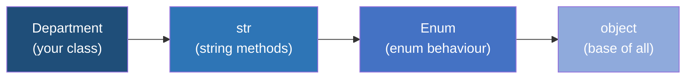

> Python searches **left to right** and uses the **first match** found.

```python
print(Department.__mro__)
# Department → str → Enum → object

# str comes before Enum, so str.__eq__ is used
# That's why:  Department.RADIOLOGY == "radiology"  → True
```

### MRO for `int` Enum

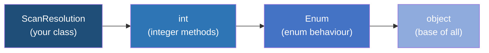

```python
# int comes before Enum, so int.__gt__ is used
# That's why:  ScanResolution.HIGH > ScanResolution.LOW  → True
```

### The Diamond Problem — Multiple Inheritance MRO

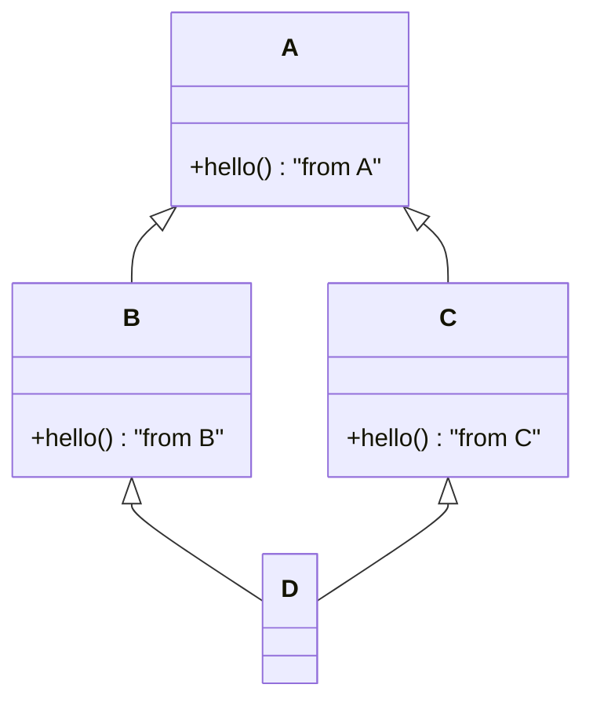

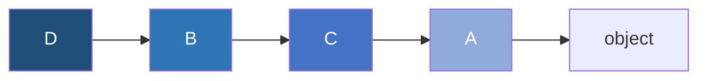

```python
class A:
    def hello(self): return "from A"

class B(A):
    def hello(self): return "from B"

class C(A):
    def hello(self): return "from C"

class D(B, C):  # D(B, C) → B is listed first
    pass

print(D.__mro__)   # D → B → C → A → object
print(D().hello()) # "from B"  — B comes first in MRO
```

### Method Lookup Flow

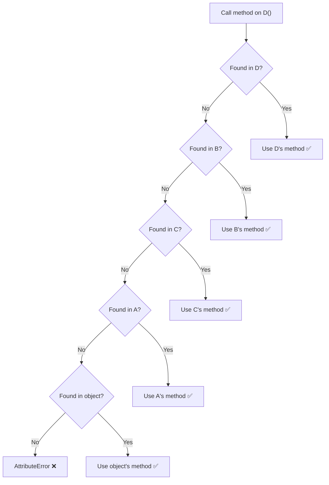

### MRO Summary

| Scenario | MRO Order | Effect |
|---|---|---|
| `class Status(str, Enum)` | `Status → str → Enum → object` | String methods work natively |
| `class Code(int, Enum)` | `Code → int → Enum → object` | Integer comparisons work natively |
| `class D(B, C)` | `D → B → C → A → object` | B's methods win over C's |

---

## 7. Practical Example — Appointment Scheduling

### State Transition Diagram

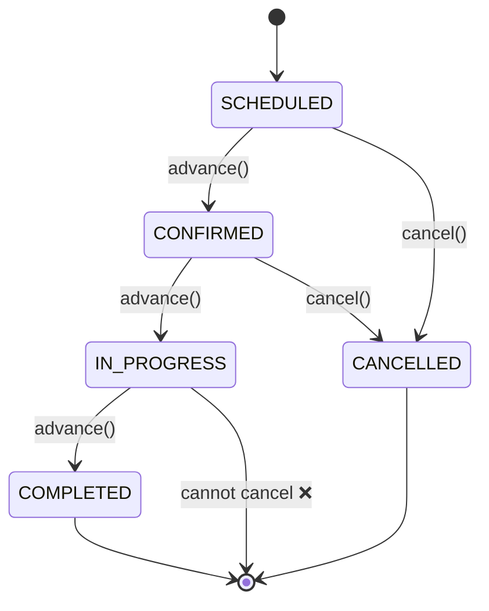

```python
from enum import Enum

class AppointmentStatus(str, Enum):
    SCHEDULED   = "scheduled"
    CONFIRMED   = "confirmed"
    IN_PROGRESS = "in_progress"
    COMPLETED   = "completed"
    CANCELLED   = "cancelled"

class ConsultationType(str, Enum):
    IN_PERSON   = "in_person"
    TELECONSULT = "teleconsult"
    EMERGENCY   = "emergency"

    def requires_physical_presence(self) -> bool:
        return self in (ConsultationType.IN_PERSON, ConsultationType.EMERGENCY)


class Appointment:
    def __init__(self, appt_id: str, patient_id: str, consult_type: ConsultationType):
        self.appt_id = appt_id
        self.patient_id = patient_id
        self.consult_type = consult_type
        self.status = AppointmentStatus.SCHEDULED

    def advance(self) -> None:
        transitions = {
            AppointmentStatus.SCHEDULED:   AppointmentStatus.CONFIRMED,
            AppointmentStatus.CONFIRMED:   AppointmentStatus.IN_PROGRESS,
            AppointmentStatus.IN_PROGRESS: AppointmentStatus.COMPLETED,
        }
        if self.status in transitions:
            self.status = transitions[self.status]
        else:
            print(f"Cannot advance from {self.status.value}")

    def cancel(self) -> bool:
        if self.status in (AppointmentStatus.SCHEDULED, AppointmentStatus.CONFIRMED):
            self.status = AppointmentStatus.CANCELLED
            return True
        print("Cannot cancel — appointment already in progress or completed.")
        return False
```

---

## Quick Reference

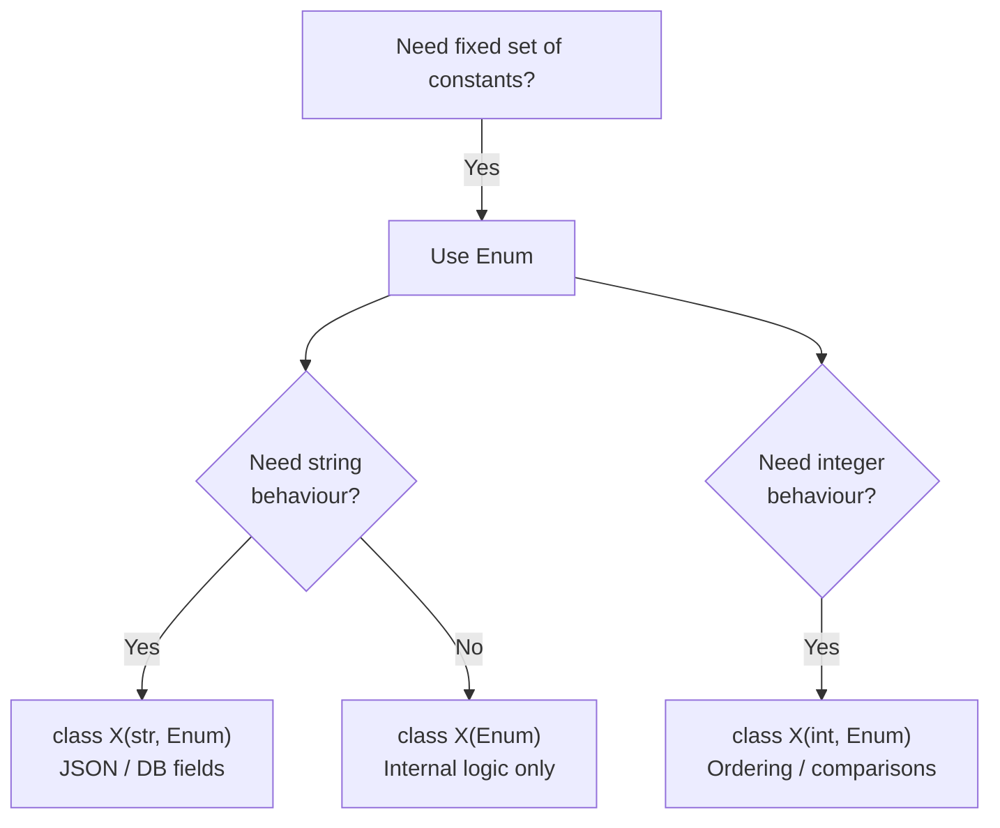

| Type | Syntax | Behaves like | Use when |
|---|---|---|---|
| Basic Enum | `class X(Enum)` | Only an Enum | Internal logic, no serialization needed |
| String Enum | `class X(str, Enum)` | `str` + `Enum` | JSON, DB fields, Django choices |
| Int Enum | `class X(int, Enum)` | `int` + `Enum` | Ordering, comparisons, bit flags |

---

## Key Takeaway

> Use enums whenever a value can only be one of a fixed set of options.  
> Use `str` or `int` mixin when you need the enum to interoperate with serialization or comparisons.  
> MRO determines which class's behaviour wins — left to right in the inheritance list.