# OOP — Inheritance

## The Core Idea

> Inheritance = Define common logic once in a base class, extend or specialise in derived classes.

Enables **code reuse**, **logical hierarchy**, and is a prerequisite for **polymorphism**.

---

## 1. Real-World Analogy — User System

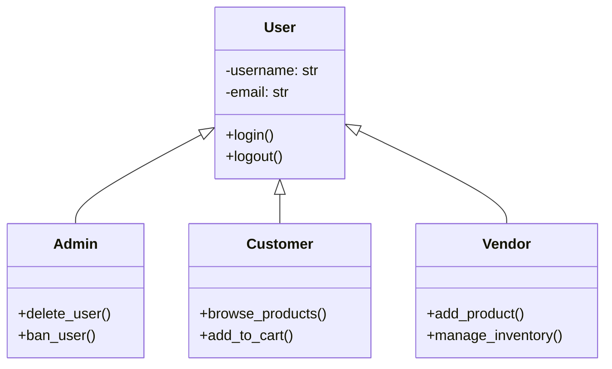

`User` holds common attributes and behaviour. `Admin`, `Customer`, `Vendor` inherit everything from `User` and add their own role-specific behaviour.

---

## 2. Why Inheritance Matters

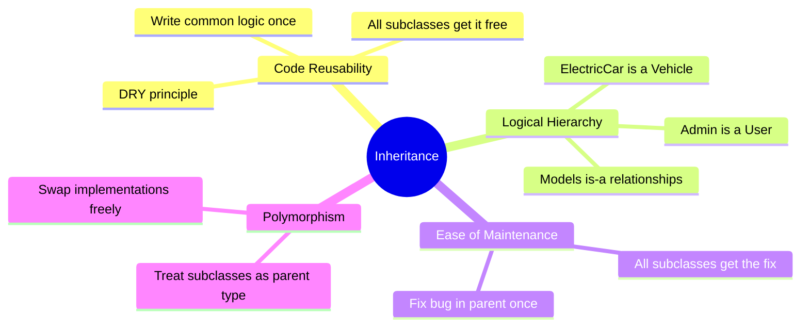

---

## 3. How It Works

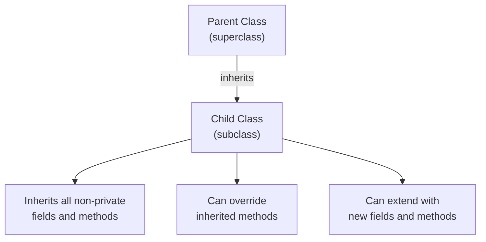

### Example — Vehicle Hierarchy

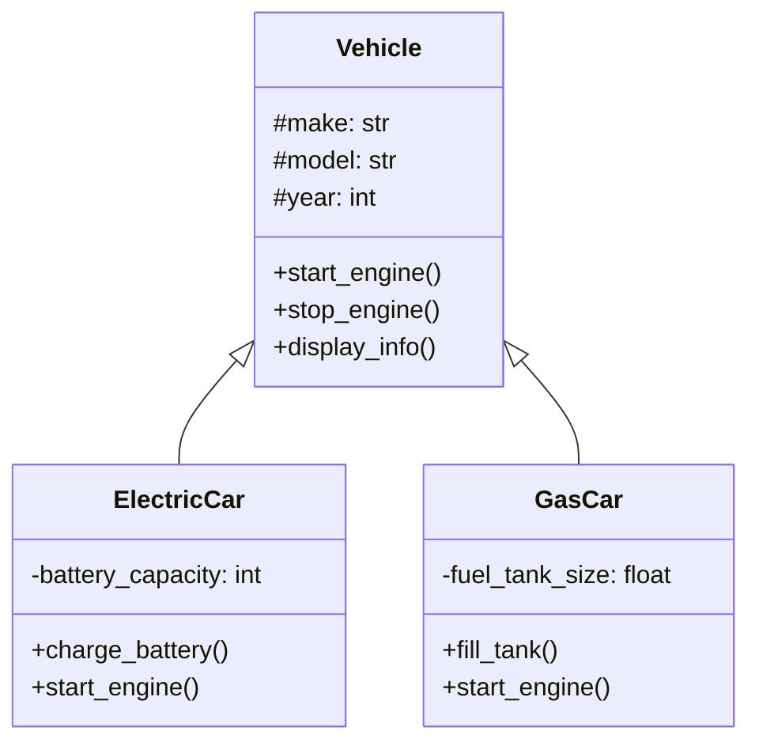

```python
class Vehicle:
    def __init__(self, make: str, model: str, year: int):
        self.make = make
        self.model = model
        self.year = year

    def start_engine(self) -> None:
        print(f"{self.make} {self.model}: engine started.")

    def stop_engine(self) -> None:
        print(f"{self.make} {self.model}: engine stopped.")

    def display_info(self) -> None:
        print(f"{self.year} {self.make} {self.model}")


class ElectricCar(Vehicle):
    def __init__(self, make: str, model: str, year: int, battery: int):
        super().__init__(make, model, year)
        self.battery_capacity = battery

    def charge_battery(self) -> None:
        print(f"Charging {self.battery_capacity}kWh battery.")

    def start_engine(self) -> None:           # override
        print(f"{self.make} {self.model}: electric motor engaged silently.")


class GasCar(Vehicle):
    def __init__(self, make: str, model: str, year: int, tank: float):
        super().__init__(make, model, year)
        self.fuel_tank_size = tank

    def fill_tank(self) -> None:
        print(f"Filling {self.fuel_tank_size}L tank.")

    def start_engine(self) -> None:           # override
        print(f"{self.make} {self.model}: combustion engine roaring.")
```

---

## 4. Types of Inheritance

### Single Inheritance

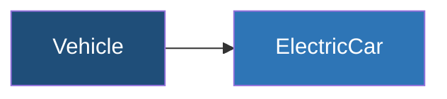

One parent, one child. Most common pattern. Supported by all languages.

---

### Multi-level Inheritance

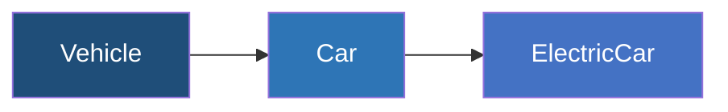

Each level adds more specialisation. Keep chains shallow — 2–3 levels max.

---

### Hierarchical Inheritance

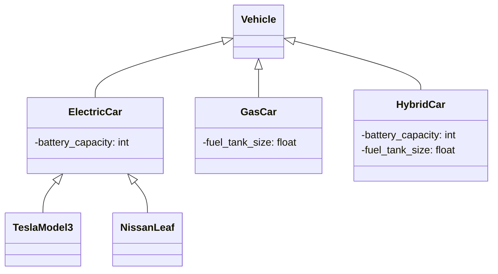

Multiple children from one parent. Very common, perfectly natural.

---

### Multiple Inheritance — The Diamond Problem

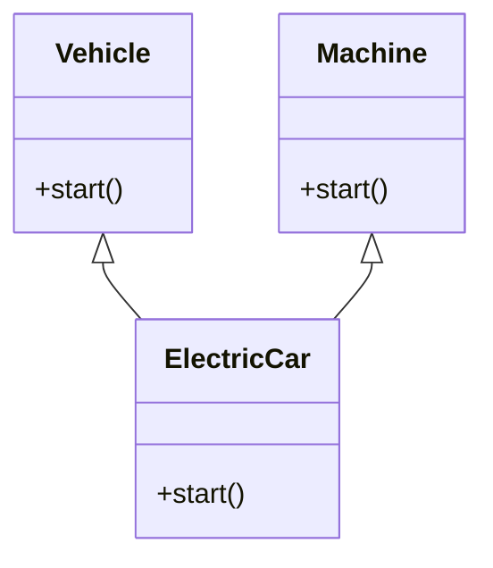

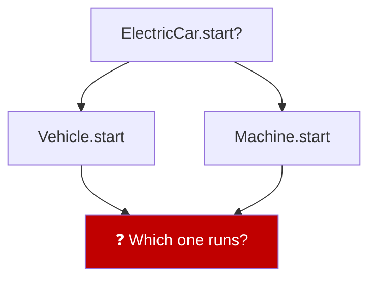

| Language | How it handles it |
|---|---|
| Python | MRO — C3 linearization (left to right) |
| C++ | Virtual inheritance (complex) |
| Java / C# | Not allowed — single class inheritance only |

---

## 5. When to Use Inheritance

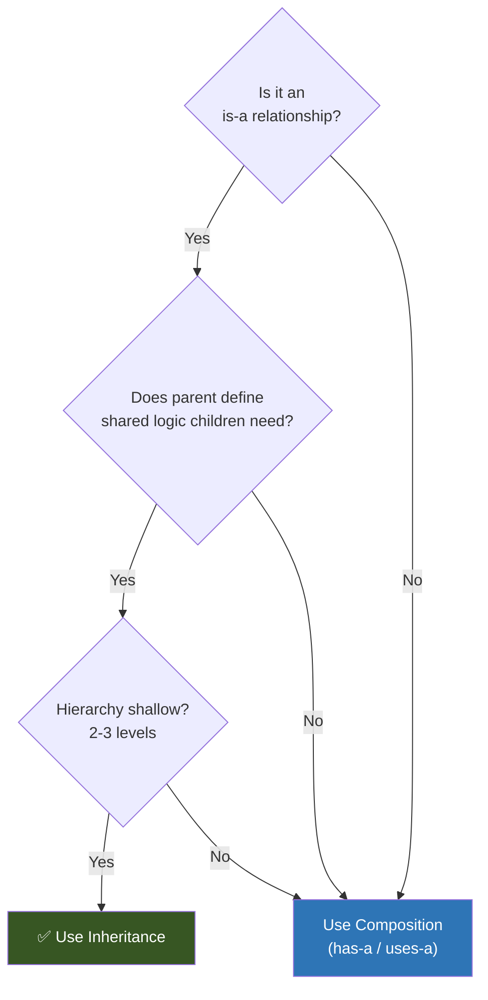

### Use Inheritance When
- Clear **is-a** relationship → `Dog` is an `Animal`, `Admin` is a `User`
- Parent has common behaviour children should share
- Hierarchy is **shallow** (2–3 levels max)
- Child does not violate behaviour expected from parent

### Avoid Inheritance When
- Relationship is **has-a** or **uses-a** → `Car` *has* an `Engine`, not *is* an `Engine`
- You need runtime flexibility to swap behaviour → use composition + dependency injection
- You want to combine behaviours from multiple sources dynamically
- Deep hierarchy that makes changes risky

> When in doubt, **start with composition**. Refactoring composition → inheritance is easy. Untangling a deep inheritance tree is not.

---

## 6. Inheritance vs Composition

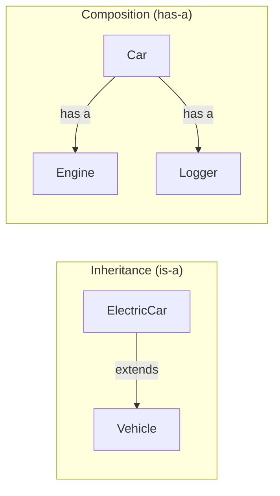

---

## 7. Practical Example — Notification System

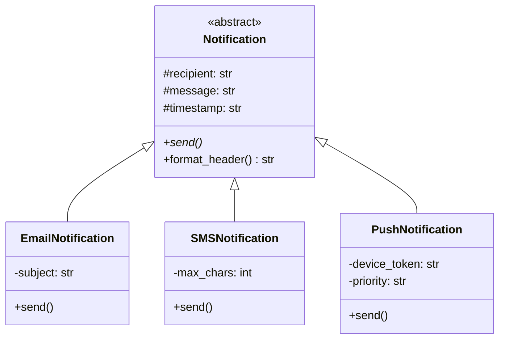

### Notification Flow

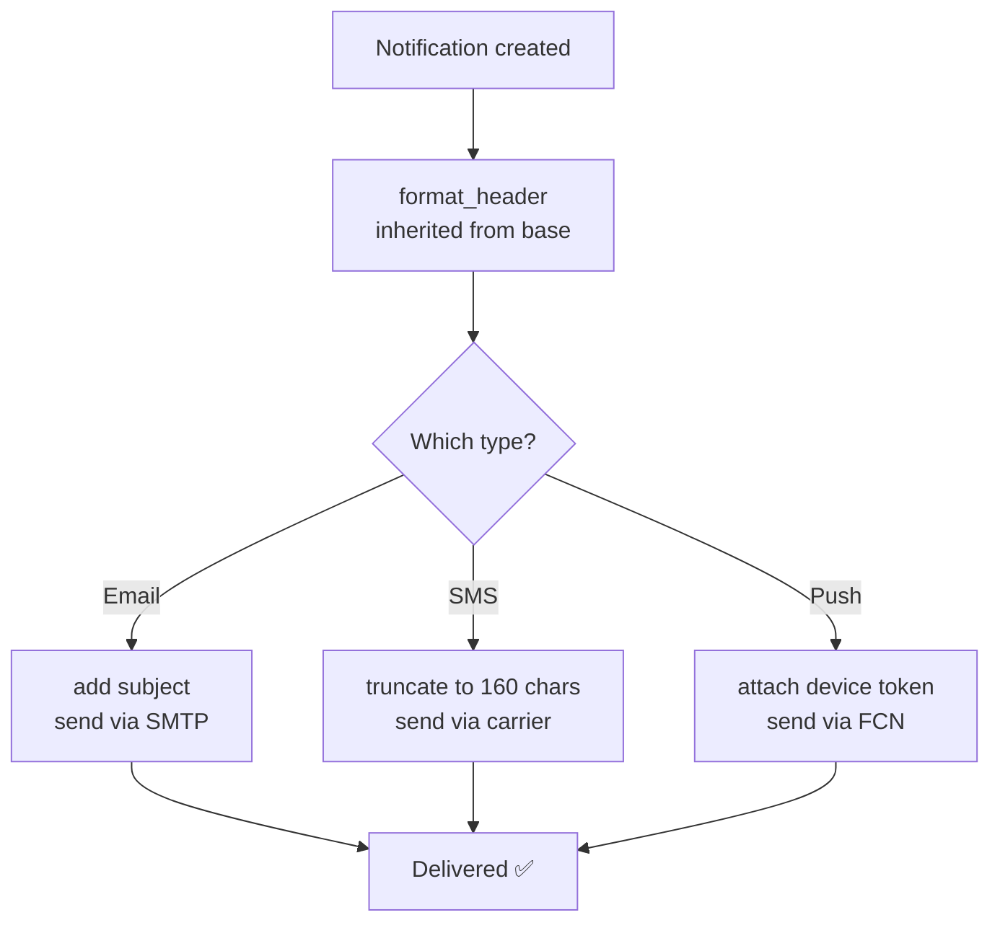

```python
from abc import ABC, abstractmethod
from datetime import datetime

class Notification(ABC):
    def __init__(self, recipient: str, message: str):
        self.recipient = recipient
        self.message = message
        self.timestamp = datetime.now().strftime("%Y-%m-%d %H:%M:%S")

    # concrete — shared by all channels
    def format_header(self) -> str:
        return f"[{self.timestamp}] To: {self.recipient}"

    @abstractmethod
    def send(self) -> None:
        pass


class EmailNotification(Notification):
    def __init__(self, recipient: str, message: str, subject: str):
        super().__init__(recipient, message)
        self.subject = subject

    def send(self) -> None:
        print(f"{self.format_header()} | Subject: {self.subject}")
        print(f"Body: {self.message}")


class SMSNotification(Notification):
    MAX_CHARS = 160

    def send(self) -> None:
        truncated = self.message[:self.MAX_CHARS]
        print(f"{self.format_header()} | SMS: {truncated}")


class PushNotification(Notification):
    def __init__(self, recipient: str, message: str, device_token: str, priority: str = "normal"):
        super().__init__(recipient, message)
        self.device_token = device_token
        self.priority = priority

    def send(self) -> None:
        print(f"{self.format_header()} | Device: {self.device_token} | Priority: {self.priority}")
        print(f"Payload: {self.message}")


# Adding a new channel — zero changes to existing code
class SlackNotification(Notification):
    def __init__(self, recipient: str, message: str, webhook_url: str):
        super().__init__(recipient, message)
        self.webhook_url = webhook_url

    def send(self) -> None:
        print(f"{self.format_header()} | Webhook: {self.webhook_url}")
        print(f"Slack message: {self.message}")


# All treated as Notification — polymorphism
notifications = [
    EmailNotification("doctor@hospital.com", "Report ready", "Patient Report"),
    SMSNotification("+1234567890", "Your appointment is confirmed for tomorrow at 10am."),
    PushNotification("patient_01", "Take your medication", "TOKEN-XYZ", "high"),
]

for n in notifications:
    n.send()   # each calls its own send() — parent reference, child behaviour
```

---

## Quick Reference

| Concept | What it means | Example |
|---|---|---|
| Single inheritance | One parent, one child | `ElectricCar(Vehicle)` |
| Multi-level | Chain of parent → child → grandchild | `Vehicle → Car → ElectricCar` |
| Hierarchical | Multiple children, one parent | `Email, SMS, Push all extend Notification` |
| Multiple | One child, multiple parents | `class D(B, C)` — Python only via MRO |
| `super()` | Call parent class method | `super().__init__(...)` |
| Override | Redefine parent method in child | `start_engine()` in `ElectricCar` |
| Extend | Add new methods/fields in child | `charge_battery()` in `ElectricCar` |

---

## Summary — All Six OOP Concepts

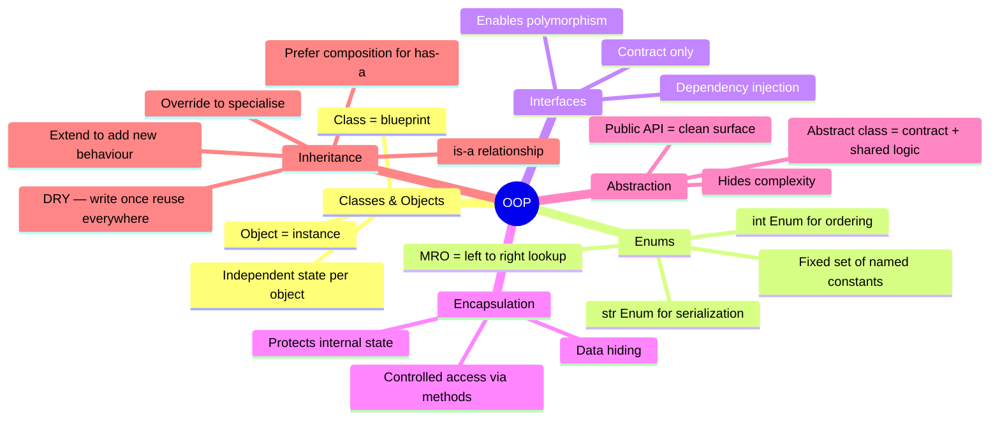

> **Classes** give structure. **Enums** give safe constants. **Interfaces** give contracts. **Encapsulation** protects state. **Abstraction** simplifies complexity. **Inheritance** enables reuse.