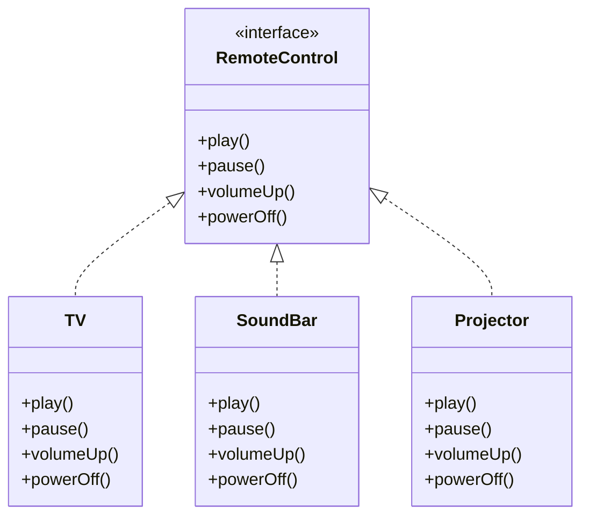
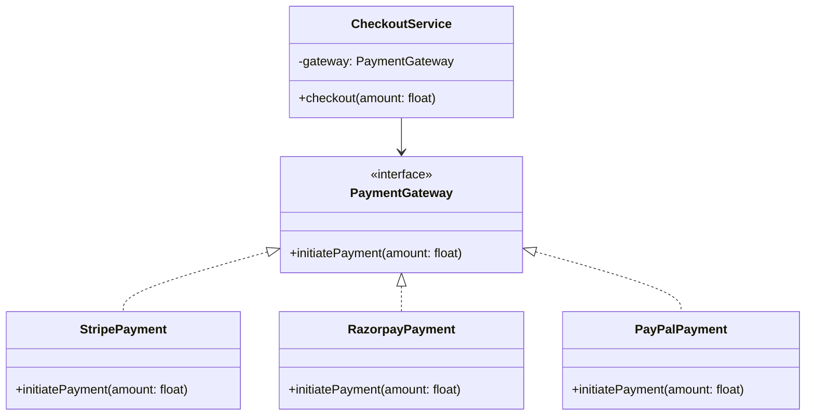
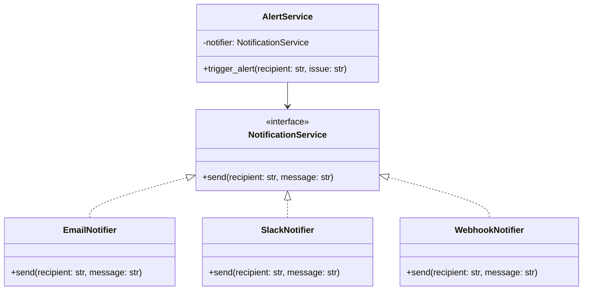
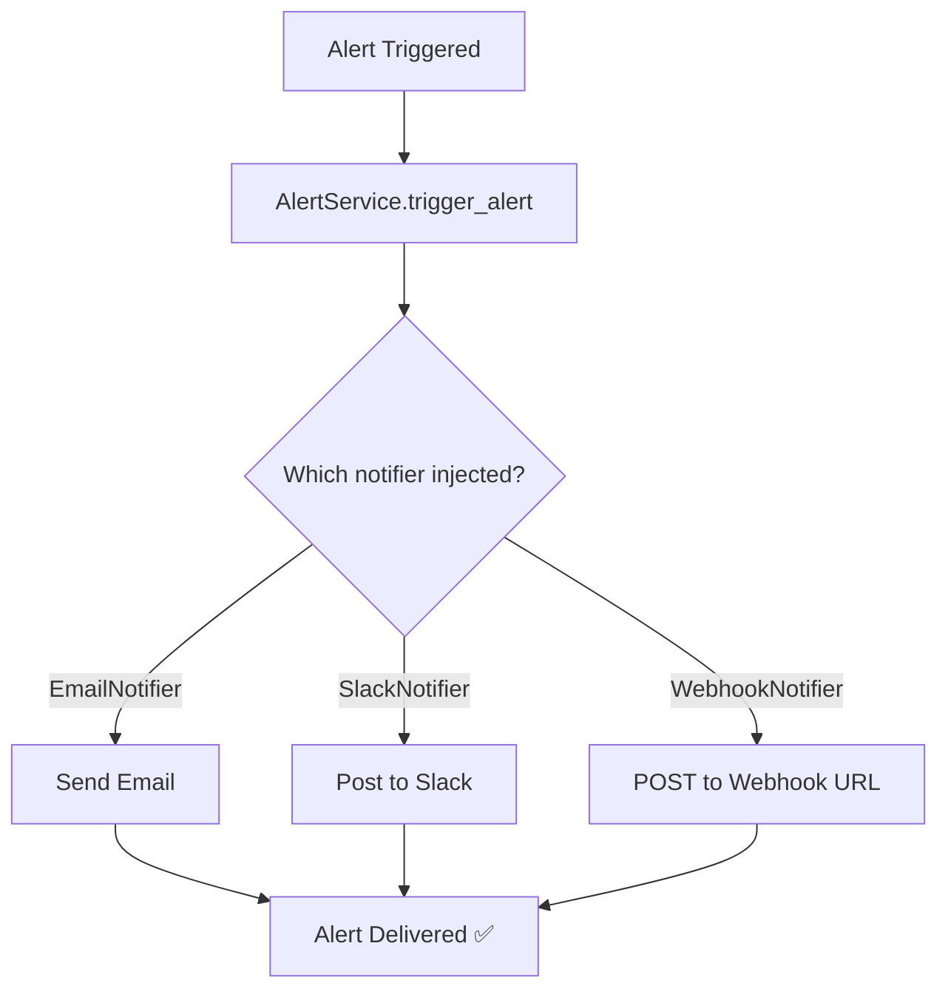
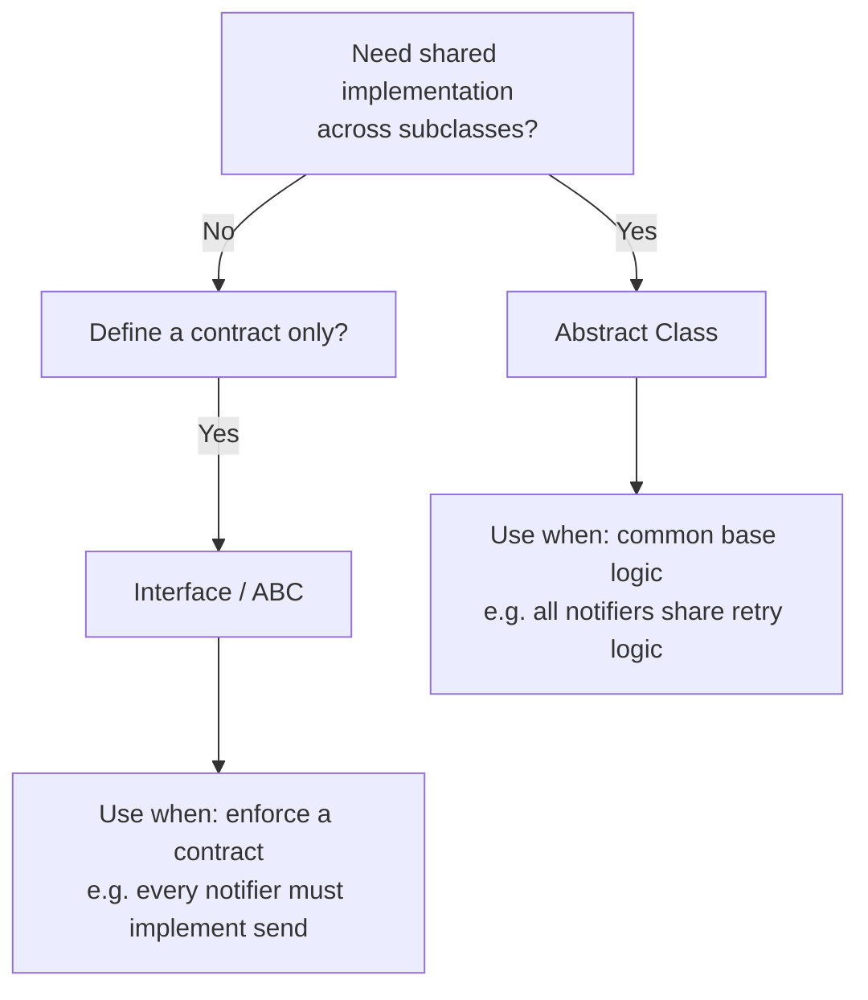
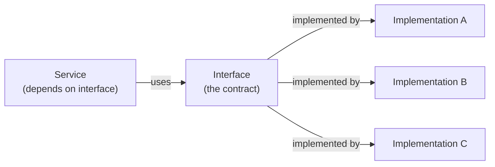

# OOP — Interfaces

## The Core Idea

An interface defines **what** a component should do, not **how** it should do it.

> An interface is a contract — a list of methods any implementing class must provide.

---

## 1. What is an Interface?



The remote is the interface. The devices are the implementations. Each device behaves differently when you press `play()`, but the contract stays consistent.

---

## 2. Key Properties

### a) Defines Behaviour Without Dictating Implementation
Only declares **what** operations are expected. Each implementer provides their own logic.

### b) Enables Polymorphism
Different classes implement the same interface in different ways — used interchangeably.

### c) Promotes Decoupling



`CheckoutService` depends only on the interface — not on any specific provider. Swap providers without touching `CheckoutService`.

---

## 3. Code Example — Payment Gateway

### Defining the Interface

```python
from abc import ABC, abstractmethod

class PaymentGateway(ABC):
    @abstractmethod
    def initiate_payment(self, amount: float) -> None:
        pass
```

### Implementing the Interface

```python
class StripePayment(PaymentGateway):
    def initiate_payment(self, amount: float) -> None:
        print(f"[Stripe] Processing payment of ${amount}")

class RazorpayPayment(PaymentGateway):
    def initiate_payment(self, amount: float) -> None:
        print(f"[Razorpay] Processing payment of ₹{amount}")
```

Both implement the same contract — internal logic is completely different.

### Programming to the Interface

```python
class CheckoutService:
    def __init__(self, gateway: PaymentGateway):
        self.gateway = gateway          # depends on interface, not implementation

    def checkout(self, amount: float) -> None:
        print("Starting checkout...")
        self.gateway.initiate_payment(amount)
```

> This pattern is called **dependency injection** — the class receives its dependency from outside, typed as an interface.

### Runtime Flexibility

```python
# Swap implementations without changing CheckoutService
service = CheckoutService(StripePayment())
service.checkout(100.0)
# [Stripe] Processing payment of $100.0

service = CheckoutService(RazorpayPayment())
service.checkout(100.0)
# [Razorpay] Processing payment of ₹100.0
```

---

## 4. Practical Example — Notification Service

### Class Diagram



### Flow Diagram



### Code

```python
from abc import ABC, abstractmethod

class NotificationService(ABC):
    @abstractmethod
    def send(self, recipient: str, message: str) -> None:
        pass


class EmailNotifier(NotificationService):
    def send(self, recipient: str, message: str) -> None:
        print(f"[Email] To: {recipient} | {message}")


class SlackNotifier(NotificationService):
    def send(self, recipient: str, message: str) -> None:
        print(f"[Slack] @{recipient} | {message}")


class WebhookNotifier(NotificationService):
    def send(self, recipient: str, message: str) -> None:
        print(f"[Webhook] POST → {recipient} | payload: {message}")


class AlertService:
    def __init__(self, notifier: NotificationService):
        self.notifier = notifier

    def trigger_alert(self, recipient: str, issue: str) -> None:
        message = f"ALERT: {issue}"
        self.notifier.send(recipient, message)


# Wiring at runtime
alert = AlertService(SlackNotifier())
alert.trigger_alert("ops-team", "Server CPU > 90%")

alert = AlertService(EmailNotifier())
alert.trigger_alert("admin@hospital.com", "Disk usage critical")
```

### Adding a New Channel (Zero Changes to AlertService)

```python
# Need PagerDuty? Just add a new class.
class PagerDutyNotifier(NotificationService):
    def send(self, recipient: str, message: str) -> None:
        print(f"[PagerDuty] Paging: {recipient} | {message}")

# AlertService works immediately — no modifications needed
alert = AlertService(PagerDutyNotifier())
alert.trigger_alert("on-call-engineer", "DB connection pool exhausted")
```

---

## 5. Interface vs Abstract Class



| | Interface `ABC` | Abstract Class |
|---|---|---|
| Has implementation | ❌ abstract only | ✅ can have concrete methods |
| Multiple inheritance | ✅ | ⚠️ use carefully |
| Purpose | Define a contract | Share common behaviour |
| Python keyword | `@abstractmethod` | `@abstractmethod` + concrete methods |

---

## Quick Reference



> **Program to the interface, not the implementation.**  
> The calling code should only know about the contract — never about which concrete class is behind it.

---

## Key Takeaway

- **Interface** — defines the `what` (contract)
- **Implementation** — defines the `how` (concrete logic)
- **Dependency injection** — pass the interface in from outside, don't create it internally
- **Result** — swap, extend, or mock any implementation without touching the calling code