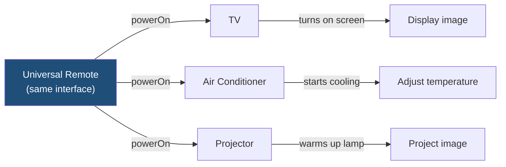
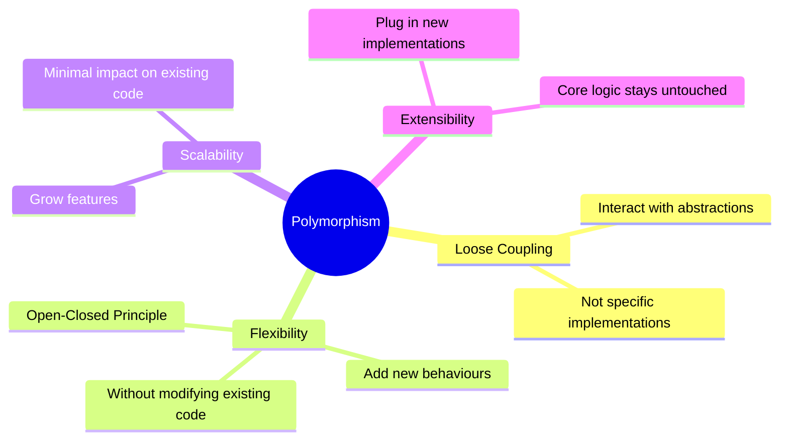
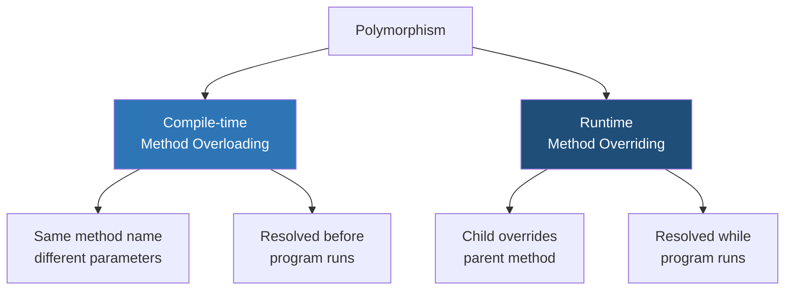
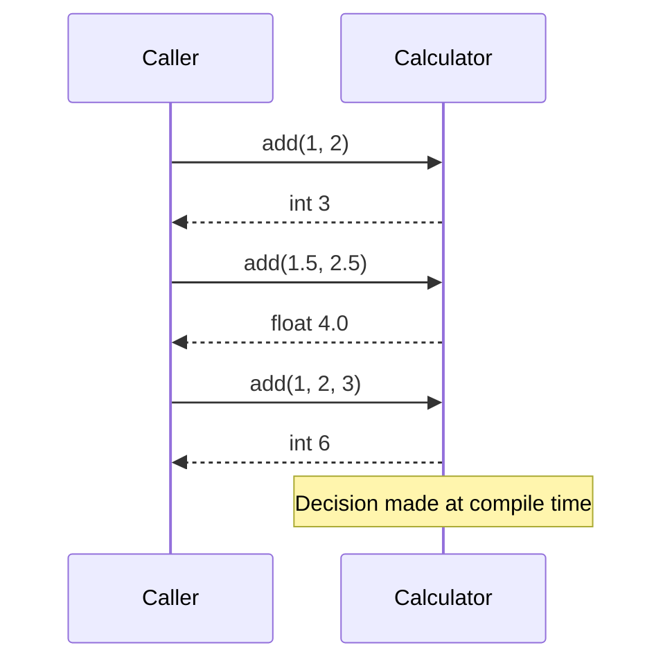
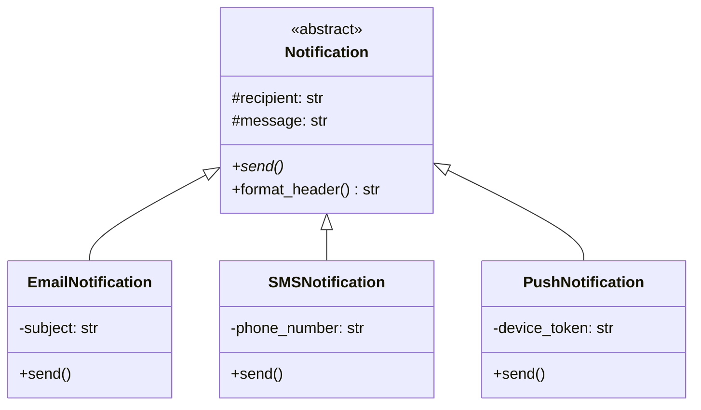
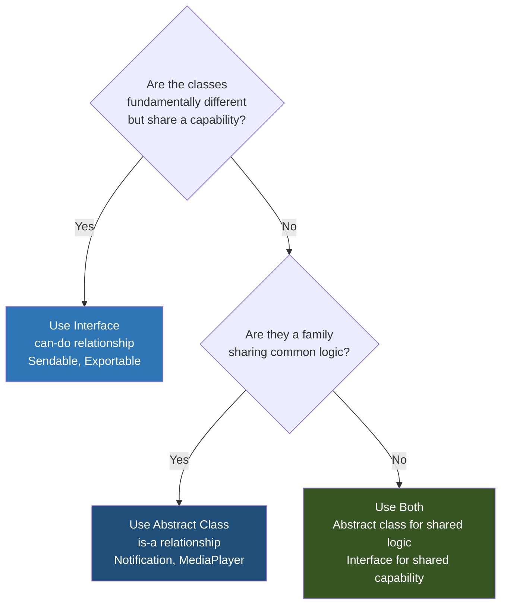
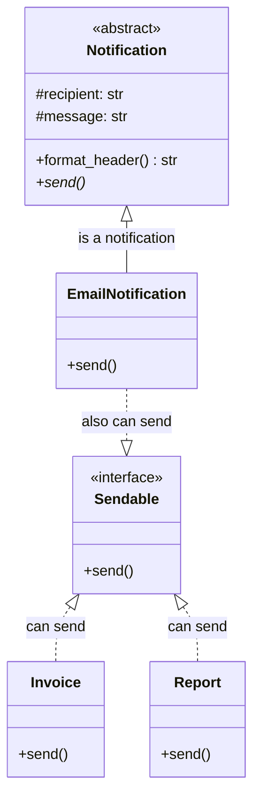
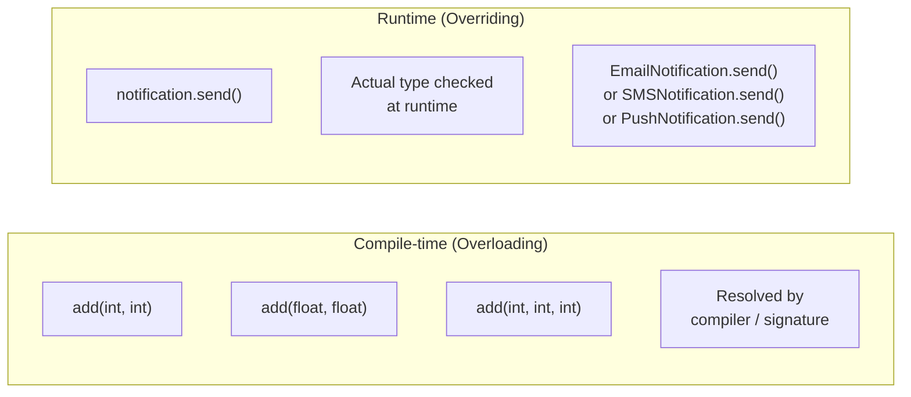
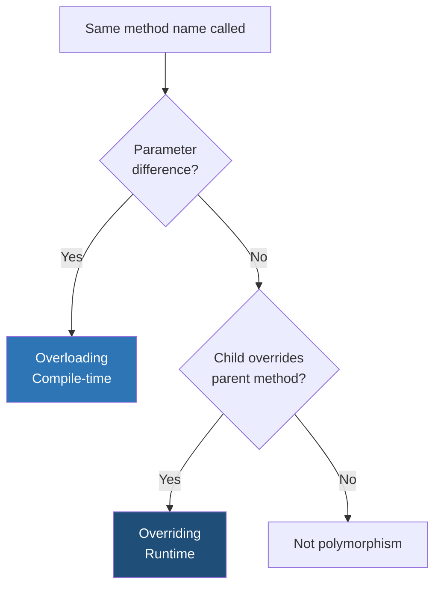
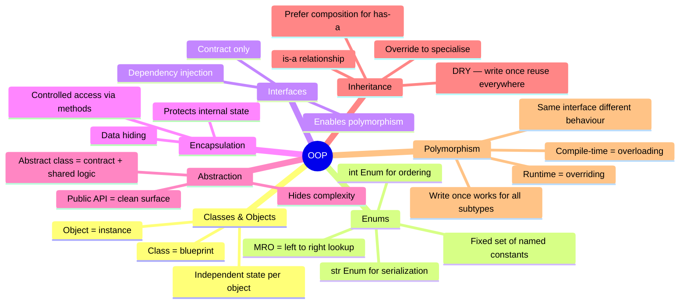

# OOP — Polymorphism

## The Core Idea

> Polymorphism = Same method name, different behaviour depending on the object invoking it.

Write code that targets a **common type**. The actual behaviour is determined by the **concrete implementation**.

---

## 1. Real-World Analogy — Universal Remote



Same buttons. Different behaviour per device. The interface never changes — the receiver decides what happens.

---

## 2. Why Polymorphism Matters



---

## 3. Two Forms of Polymorphism



---

## 4. Compile-time Polymorphism — Method Overloading

Same method name, different parameter lists. Compiler picks the right one **before the program runs**.



```python
# Python doesn't have native overloading
# but achieves it via default args or type checks

class Calculator:
    def add(self, a, b, c=None):
        if c is not None:
            return a + b + c
        return a + b

calc = Calculator()
print(calc.add(1, 2))       # 3
print(calc.add(1.5, 2.5))   # 4.0
print(calc.add(1, 2, 3))    # 6
```

> Python resolves this at **runtime** via duck typing. Java/C++ do true compile-time overloading with separate method signatures.

---

## 5. Runtime Polymorphism — Method Overriding

Child class overrides a parent method. The decision of **which version runs** is made at runtime based on the actual object type.



### Dynamic Dispatch Flow

```mermaid
sequenceDiagram
    participant Loop
    participant Ref as "Notification\n(reference)"
    participant Actual as "Actual object\nat runtime"

    Loop->>Ref: call send()
    Ref->>Actual: which type am I?
    Actual-->>Ref: EmailNotification
    Ref->>Actual: invoke EmailNotification.send()
    Actual-->>Loop: sends via SMTP

    Loop->>Ref: call send()
    Ref->>Actual: which type am I?
    Actual-->>Ref: SMSNotification
    Ref->>Actual: invoke SMSNotification.send()
    Actual-->>Loop: sends via carrier
```

```python
from abc import ABC, abstractmethod
from datetime import datetime

class Notification(ABC):
    def __init__(self, recipient: str, message: str):
        self.recipient = recipient
        self.message = message

    def format_header(self) -> str:
        ts = datetime.now().strftime("%Y-%m-%d %H:%M:%S")
        return f"[{ts}] To: {self.recipient}"

    @abstractmethod
    def send(self) -> None:
        pass


class EmailNotification(Notification):
    def __init__(self, recipient: str, message: str, subject: str):
        super().__init__(recipient, message)
        self.subject = subject

    def send(self) -> None:
        print(f"{self.format_header()} | Email | Subject: {self.subject} | {self.message}")


class SMSNotification(Notification):
    def send(self) -> None:
        print(f"{self.format_header()} | SMS | {self.message[:160]}")


class PushNotification(Notification):
    def __init__(self, recipient: str, message: str, device_token: str):
        super().__init__(recipient, message)
        self.device_token = device_token

    def send(self) -> None:
        print(f"{self.format_header()} | Push | Token: {self.device_token} | {self.message}")


# All stored as Notification references — runtime picks the right send()
notifications: list[Notification] = [
    EmailNotification("doctor@hospital.com", "Report ready", "Patient Report"),
    SMSNotification("+1234567890", "Appointment confirmed for tomorrow."),
    PushNotification("patient_01", "Take your medication now.", "TOKEN-XYZ"),
]

for n in notifications:
    n.send()   # same call — different behaviour each time
```

```
[2025-01-01 10:00:00] To: doctor@hospital.com | Email | Subject: Patient Report | Report ready
[2025-01-01 10:00:00] To: +1234567890 | SMS | Appointment confirmed for tomorrow.
[2025-01-01 10:00:00] To: patient_01 | Push | Token: TOKEN-XYZ | Take your medication now.
```

> The variable type says `Notification`. The behaviour says `EmailNotification`, `SMSNotification`, `PushNotification`. That's runtime polymorphism.

---

## 6. Polymorphism with Interfaces vs Abstract Classes



### Side-by-side Comparison



| Aspect | Interface | Abstract Class |
|---|---|---|
| Relationship | **can-do** (capability) | **is-a** (family) |
| Shared behaviour | ❌ contract only | ✅ concrete methods + fields |
| Multiple | ✅ implement many | ❌ extend only one |
| Use when | Unrelated classes share a capability | Related classes share logic |
| Example | `Sendable` — Email, Invoice, Report | `Notification` — Email, SMS, Push |

> In practice, **use both** — abstract class for shared logic, interface for shared capability.

---

## 7. Compile-time vs Runtime Summary



| | Compile-time | Runtime |
|---|---|---|
| Also called | Method Overloading | Method Overriding / Dynamic Dispatch |
| Decided | Before program runs | While program runs |
| Based on | Parameter types/count | Actual object type |
| Requires | Same class | Parent-child relationship |
| Power | Low–Medium | High |

---

## Quick Reference



---

## Summary — All Seven OOP Concepts



> **Classes** give structure. **Enums** give safe constants. **Interfaces** give contracts. **Encapsulation** protects state. **Abstraction** simplifies complexity. **Inheritance** enables reuse. **Polymorphism** makes it all flexible.