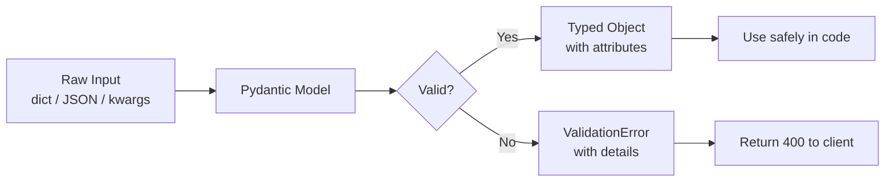
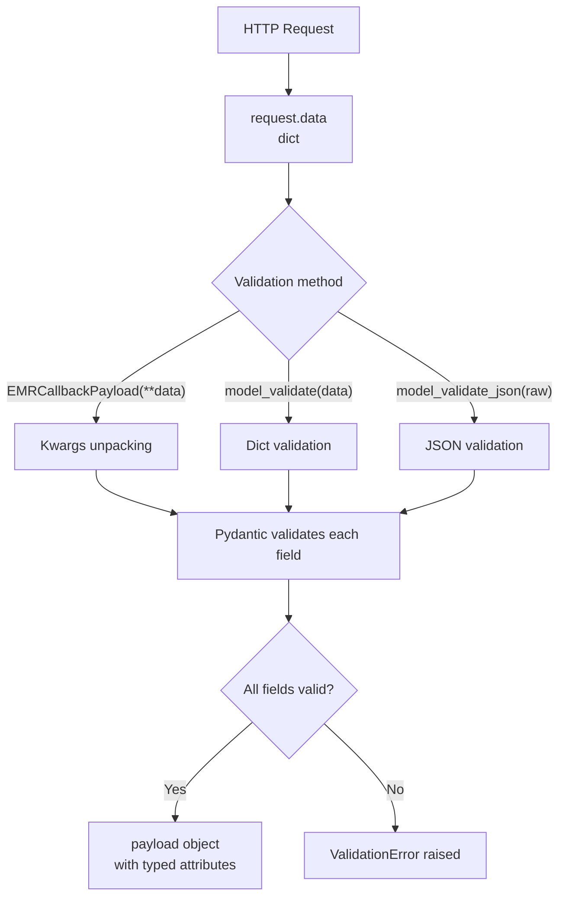
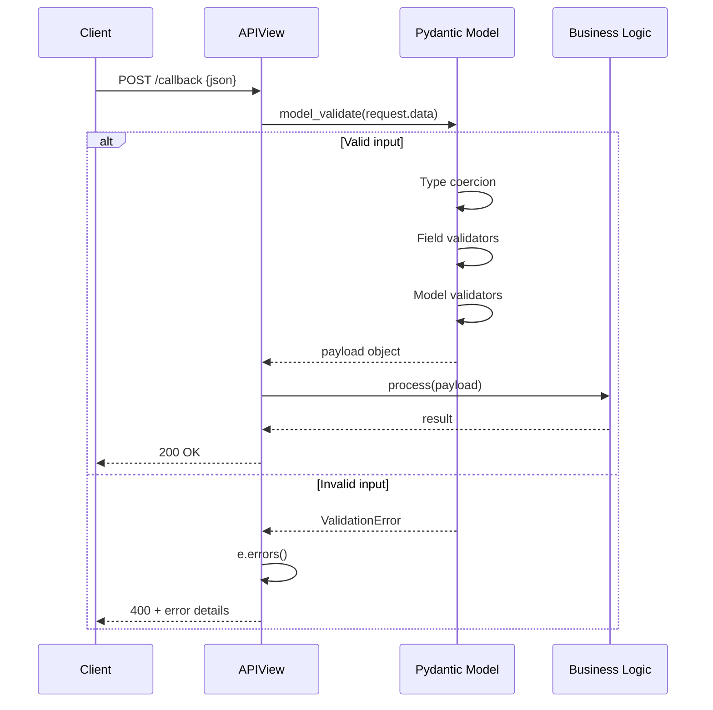

# Pydantic Notes

## What is Pydantic?

Pydantic is a Python library for **data validation and parsing** using Python type hints. You define what your data should look like with normal type annotations, and Pydantic enforces it at runtime — converting, validating, and producing clear errors when things don't match.

It's the de facto standard for:
- API request/response validation (FastAPI is built on it)
- Parsing external data (webhooks, config files, third-party APIs)
- Settings management (`pydantic-settings`)
- Anywhere you'd otherwise write `isinstance` checks and manual conversions

**Pydantic v2** (current) is a major rewrite with a Rust core — significantly faster than v1 and with slightly different APIs (`.model_validate()` instead of `.parse_obj()`, `model_config` instead of `class Config`, etc.).

## Mental Model



Pydantic sits at your application's boundary — anywhere untrusted data enters. Inside that boundary, you work with proper typed objects instead of dicts of unknown shape.

## Basic Usage

```python
from pydantic import BaseModel

class EMRCallbackPayload(BaseModel):
    status: str
    event_type: str
    workspace_id: int
```

That's it — `BaseModel` gives you validation, parsing, serialization, and a `.model_dump()` for free.

## Data Input Patterns

### 1. Unpacking dict with `**` (DRF convention)
```python
payload = EMRCallbackPayload(**request.data)
```
- Unpacks dict into keyword arguments
- DRF idiomatic
- Less explicit about validation

### 2. Direct validation with `.model_validate()` (Pydantic v2)
```python
payload = EMRCallbackPayload.model_validate(request.data)
```
- More explicit — you're validating a dict input
- Works with Pydantic's validation hooks (custom validators, aliases)
- Preferred when parsing external data

### 3. From raw JSON string
```python
payload = EMRCallbackPayload.model_validate_json(raw_json_bytes)
```
- Skips the `json.loads()` step
- Faster (parses + validates in one pass via the Rust core)

### 4. From requests library
```python
import requests
response = requests.post(...)
payload = EMRCallbackPayload.model_validate(response.json())
```

## Input Flow Diagram



## Field Types & Validation

Pydantic uses your type hints to coerce and validate.

```python
from enum import Enum
from datetime import datetime
from typing import Optional
from pydantic import BaseModel, Field

class EMRCallbackStatus(str, Enum):
    COMPLETED = 'completed'
    PENDING = 'pending'
    FAILED = 'failed'

class EMRCallbackPayload(BaseModel):
    status: EMRCallbackStatus                  # validates against enum
    event_type: str
    workspace_id: int                          # coerces "123" → 123
    retry_count: int = 0                       # default value
    metadata: Optional[dict] = None            # optional field
    received_at: datetime                      # parses ISO 8601 strings
    notes: str = Field(default="", max_length=500)  # field-level constraints
```

### Common Field constraints

| Constraint | Example |
|---|---|
| String length | `Field(min_length=1, max_length=100)` |
| Numeric range | `Field(ge=0, le=100)` (≥ and ≤) |
| Regex | `Field(pattern=r'^[A-Z]{2}\d+$')` |
| Alias | `Field(alias='event-type')` (for kebab-case JSON) |
| Description | `Field(description='Type of sync event')` |

## Custom Validators

For logic Pydantic can't express with types alone:

```python
from pydantic import BaseModel, field_validator, model_validator

class EMRCallbackPayload(BaseModel):
    status: EMRCallbackStatus
    event_type: str
    workspace_id: int

    @field_validator('event_type')
    @classmethod
    def validate_event_type(cls, v: str) -> str:
        allowed = {'full', 'patient', 'incremental'}
        if v not in allowed:
            raise ValueError(f'event_type must be one of {allowed}')
        return v

    @model_validator(mode='after')
    def check_consistency(self):
        if self.status == EMRCallbackStatus.COMPLETED and not self.event_type:
            raise ValueError('Completed callbacks must have event_type')
        return self
```

- `@field_validator` — runs per field, can transform the value
- `@model_validator(mode='after')` — runs after all fields are populated, sees the whole object

## Validation Errors

When input doesn't match, Pydantic raises `ValidationError` with structured details:

```python
from pydantic import ValidationError

try:
    payload = EMRCallbackPayload.model_validate(request.data)
except ValidationError as e:
    return Response({'errors': e.errors()}, status=400)
```

`e.errors()` returns a list of dicts:

```json
[
  {
    "type": "enum",
    "loc": ["status"],
    "msg": "Input should be 'completed', 'pending' or 'failed'",
    "input": "unknown"
  },
  {
    "type": "int_parsing",
    "loc": ["workspace_id"],
    "msg": "Input should be a valid integer",
    "input": "abc"
  }
]
```

Useful fields on each error:
- `loc` — path to the bad field (handy for nested models)
- `type` — error category (e.g. `int_parsing`, `missing`, `enum`)
- `msg` — human-readable message
- `input` — what was actually received

### Validation Lifecycle



## Class Variable Access in Methods

Not a Pydantic thing, but it bit you earlier — worth pinning down:

```python
class EMRCallbackView(APIView):
    ALLOWED_EVENT_TYPES = {'full', 'patient', 'incremental'}

    def post(self, request):
        # ❌ Wrong — class scope not visible inside methods
        if payload.event_type in ALLOWED_EVENT_TYPES:
            pass

        # ✅ Correct — access via self
        if payload.event_type in self.ALLOWED_EVENT_TYPES:
            pass

        # ✅ Also correct — explicit class reference
        if payload.event_type in EMRCallbackView.ALLOWED_EVENT_TYPES:
            pass
```

Python's LEGB scoping (Local → Enclosing → Global → Builtin) doesn't include the class body as an enclosing scope for its methods. Use `self.` (respects subclass overrides) or the class name (explicit).

A better pattern for fixed allowed values is to put them on the Pydantic model itself as an enum — then validation handles it for free, no `in` check needed in the view.

## Serialization (Going Back Out)

The reverse of validation: turn a model into a dict or JSON.

```python
payload.model_dump()              # → dict
payload.model_dump(exclude={'metadata'})   # skip fields
payload.model_dump(exclude_none=True)      # skip None values
payload.model_dump_json()         # → JSON string
```

Useful for logging, response bodies, or storing in JSONField.

## Nested Models

Pydantic handles arbitrary nesting:

```python
class Patient(BaseModel):
    id: int
    mrn: str

class EMRCallbackPayload(BaseModel):
    status: EMRCallbackStatus
    patient: Patient                # nested model
    related_patients: list[Patient] # list of models
```

Errors include the full path (`loc: ['patient', 'mrn']`) so you can pinpoint the bad nested field.

## Model Config (Pydantic v2)

Behavior tweaks go on `model_config`:

```python
from pydantic import BaseModel, ConfigDict

class EMRCallbackPayload(BaseModel):
    model_config = ConfigDict(
        str_strip_whitespace=True,   # trim string fields
        frozen=True,                  # immutable after creation
        extra='forbid',               # reject unknown fields (vs 'ignore' / 'allow')
        populate_by_name=True,        # accept both field name and alias
    )
    
    status: EMRCallbackStatus
    event_type: str
```

`extra='forbid'` is particularly valuable for webhooks — catches typos in payload keys early instead of silently dropping them.

## Common Patterns

### Explicit validation in DRF APIView
```python
class EMRCallbackView(APIView):
    def post(self, request, workspace_id: int, patient_id: int):
        try:
            payload = EMRCallbackPayload.model_validate(request.data)
        except ValidationError as e:
            return Response({'errors': e.errors()}, status=400)

        # payload is now guaranteed valid and typed
        if payload.status == EMRCallbackStatus.COMPLETED:
            handle_completion(payload)
        return Response(status=204)
```

### Logging the dump
```python
logger.info('Received callback', extra={'payload': payload.model_dump()})
```

### Storing in Django JSONField
```python
SyncRequest.objects.create(
    workspace_id=workspace_id,
    payload=payload.model_dump(mode='json'),  # JSON-safe (datetimes → strings)
)
```

## Pydantic vs DRF Serializers

| | Pydantic | DRF Serializer |
|---|---|---|
| Speed | Very fast (Rust core) | Slower (pure Python) |
| Syntax | Type hints | Field declarations |
| Errors | Structured list | Dict by field |
| Async support | Native | Limited |
| Django integration | Manual | Built-in (ORM, querysets) |
| Best for | API boundaries, parsing external data | Tight ORM integration, generic views |

Many teams use both: Pydantic for validating incoming webhook/external payloads (where DRF serializers are overkill), DRF serializers for internal CRUD APIs tied to models.

## Key Takeaways

- **Pydantic = type hints + runtime validation.** Define the shape, let it enforce.
- **Use `.model_validate()` for external data** — it's explicit and works with all validation hooks.
- **`**dict` unpacking is fine** in DRF code where it's conventional, but less obvious about intent.
- **Enums prevent typos** — better than `in` checks on string sets.
- **`ValidationError.errors()`** gives you structured, JSON-serializable error details for clients.
- **`extra='forbid'`** for webhooks — catch unknown fields instead of silently dropping them.
- **`model_dump(mode='json')`** when persisting to JSONField or returning JSON-safe data.
- **Class variables need `self.`** inside methods — Python scoping, not Pydantic.